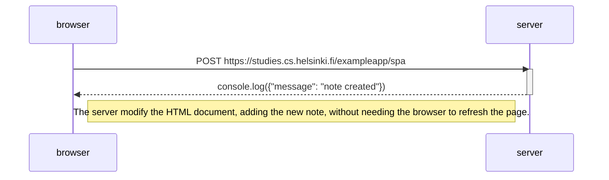

This is a simple diagram representing what's going on when a user create a new note in the SPA application using the Mermaid syntax:

```mermaid
sequenceDiagram
  participant browser
  participant server

  browser->>server: POST https://studies.cs.helsinki.fi/exampleapp/spa
  activate server
  server-->>browser: console.log({"message": "note created"})
  deactivate server

  Note right of browser: The server modify the HTML document, adding the new note, without needing the browser to refresh the page.
```